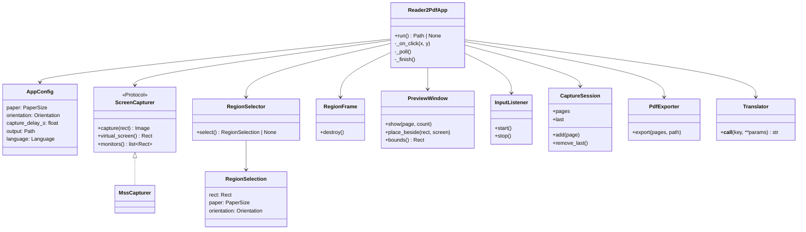
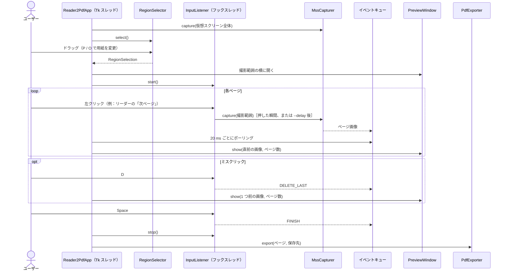

# アーキテクチャ

[English](architecture.md)

## モジュール

| モジュール          | 役割                                                                         |
| ------------------- | ---------------------------------------------------------------------------- |
| `__main__.py`       | コマンドライン引数を `AppConfig` に変換し、アプリを起動する。                  |
| `app.py`            | `Reader2PdfApp` が、範囲選択 → クリック撮影 → 書き出し の流れを進める。         |
| `geometry.py`       | `PaperSize`、`Orientation`、`Rect`、および縦横比固定ドラッグ用の `fit_aspect`。 |
| `region_selector.py`| 暗く静止させた全画面オーバーレイ。ユーザーはここで撮影範囲をドラッグする。       |
| `region_frame.py`   | 撮影範囲の*外側*に常に最前面で描く赤枠。撮影画像には写らない。                  |
| `preview_window.py` | 直前の撮影画像、ページ数、キー操作を表示する。                                 |
| `input_listener.py` | グローバルなマウス・キーボードのフック（pynput）。クリックと `KeyCommand` に変換する。 |
| `capturer.py`       | `ScreenCapturer` プロトコルと、その実装 `MssCapturer`。                         |
| `session.py`        | `CaptureSession`：撮影したページを順に保持する。直前のページを削除できる。       |
| `pdf_exporter.py`   | ページを 1 つの PDF に書き出す。ページサイズは用紙の実寸に合わせる。             |
| `i18n.py`           | UI の文言（英語が既定、日本語にも対応）。                                      |
| `platform_setup.py` | Windows の DPI 認識を有効にし、Tk・mss・pynput がすべて物理ピクセルを使うようにする。 |

## クラス図

## シーケンス図：1 回のセッション

## スレッド構成

pynput はコールバックを専用のフックスレッドで呼び出します。一方、Tk はメインスレッドからしか操作できません。そのため次のようにしています。

- 撮影は、ボタンが押された瞬間に**フックスレッド上で**行います。リーダーがクリックを処理する前にページを撮影できます。mss のハンドルはスレッドに紐づくため、呼び出しごとに mss を生成します。
- 撮影画像とキーコマンドは `queue.Queue` に入れます。Tk スレッドが 20 ms ごとに取り出します（`Reader2PdfApp._poll`）。
- プレビューウィンドウの位置と大きさは、ポーリングのたびに不変の `Rect` へコピーします。フックスレッドはこの `Rect` を参照し、プレビューウィンドウ上のクリックを無視します。
