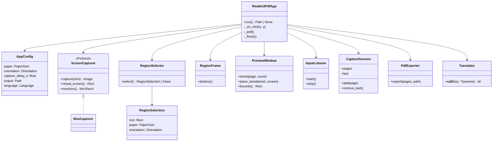
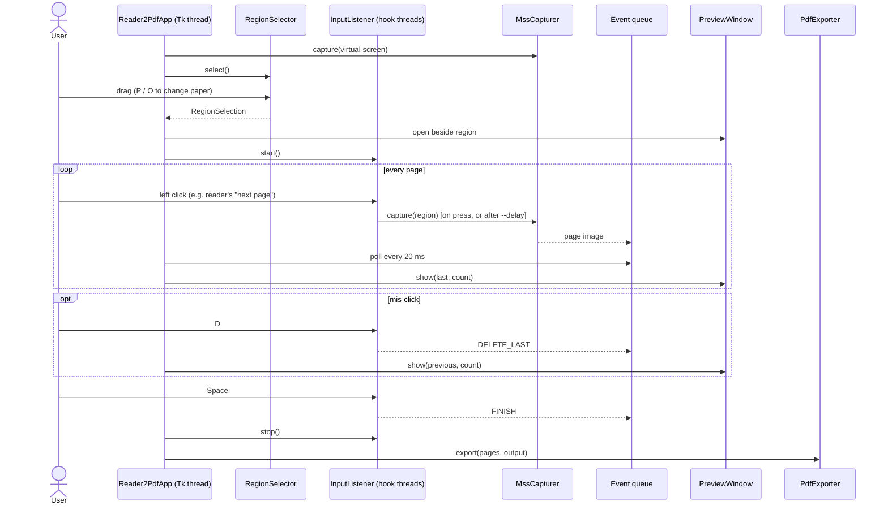

# Architecture

[日本語](architecture.ja.md)

## Modules

| Module              | Responsibility                                                                      |
| ------------------- | ----------------------------------------------------------------------------------- |
| `__main__.py`       | Parses command-line options into `AppConfig` and starts the app.                     |
| `app.py`            | `Reader2PdfApp` runs the flow: selection → click capture → export.                   |
| `geometry.py`       | `PaperSize`, `Orientation`, `Rect`, and `fit_aspect` for aspect-locked dragging.     |
| `region_selector.py`| Full-screen, dimmed, frozen overlay where the user drags out the capture region.     |
| `region_frame.py`   | Red always-on-top border drawn *outside* the region, so it never appears in a capture. |
| `preview_window.py` | Shows the last capture, the page count and the key bindings.                         |
| `input_listener.py` | Global mouse and keyboard hooks (pynput), mapped to clicks and `KeyCommand`s.        |
| `capturer.py`       | `ScreenCapturer` protocol and the `MssCapturer` implementation.                      |
| `session.py`        | `CaptureSession`: the ordered list of captured pages, with delete-last.              |
| `pdf_exporter.py`   | Writes the pages into one PDF whose page size matches the paper.                      |
| `i18n.py`           | UI text in English (default) and Japanese.                                          |
| `platform_setup.py` | Turns on Windows DPI awareness, so Tk, mss and pynput all use physical pixels.        |

## Class diagram

## Sequence: one session

## Threading

pynput runs its callbacks on its own hook threads, and Tk may only be used from the main thread. So:

- The capture runs **on the hook thread**, right when the button goes down. The page is captured before the reader handles the click. mss is created per call because its handles are thread-bound.
- Captured images and key commands go into a `queue.Queue`. The Tk thread drains it every 20 ms (`Reader2PdfApp._poll`).
- The preview window's bounds are copied to an immutable `Rect` on each poll. The hook thread reads that `Rect` to ignore clicks on the preview window.
